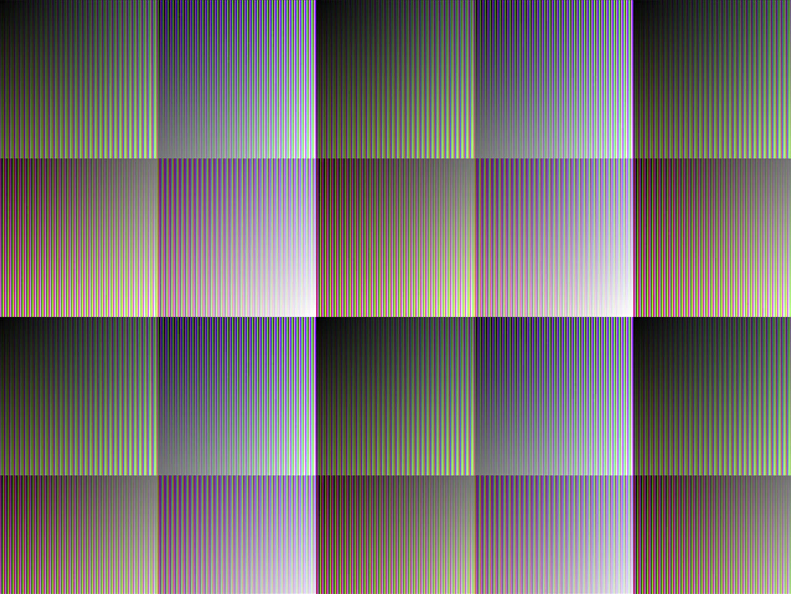
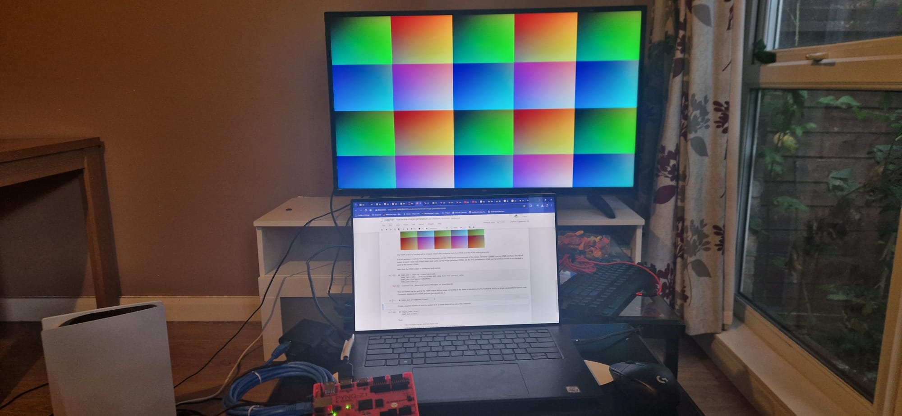

# TestBench Iteration #1
## How to use it
**(1) Run the following commands (identical to what ed uses with his example testbench)**  

```
iverilog -o stream streamer_tb.v packer.v test_streamer.v
vvp stream
gtkwave test.vcd                                                    
```  

The third command isn't really needed for a visualisation - it just opens the waveform viewer (kinda helpful for debugging).  
In addition to the .vcd file, a txt file(hex_values.txt) will be generated with all the rgb values for each pixel.
> [!NOTE]
> The text file should be have 307200 valid 24-bit words [480 x 640], but this isnt the case for some reason (There are 349996 valid words in the file!)  
  

**(2) Run the python code to generate an image from these pixel values.**  
You need to install the pillow and numpy python libraries for this. 
!!! The image generated isnt what it should be?! Why?! There are definitley similarites but somethings really off


