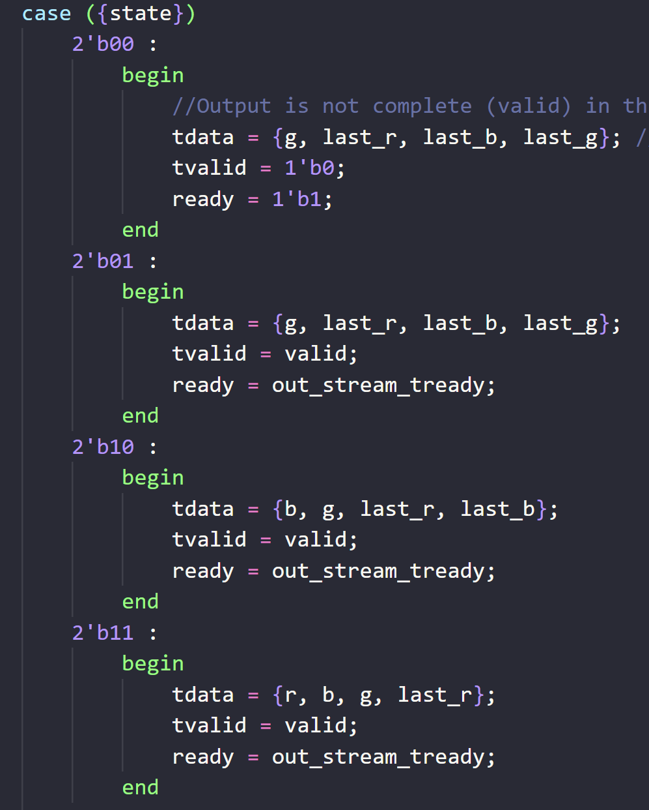
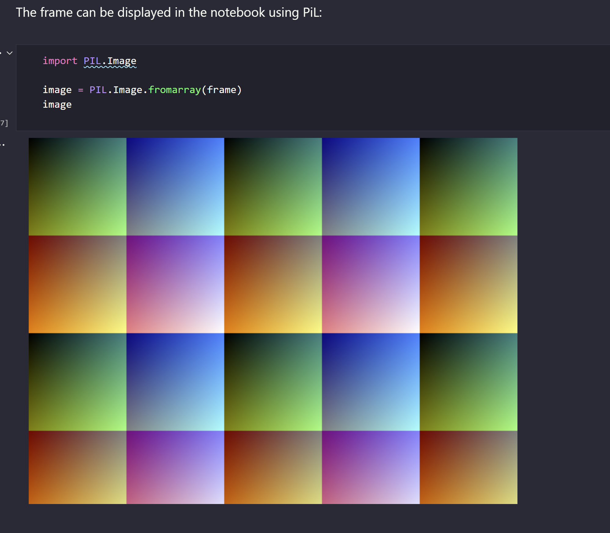
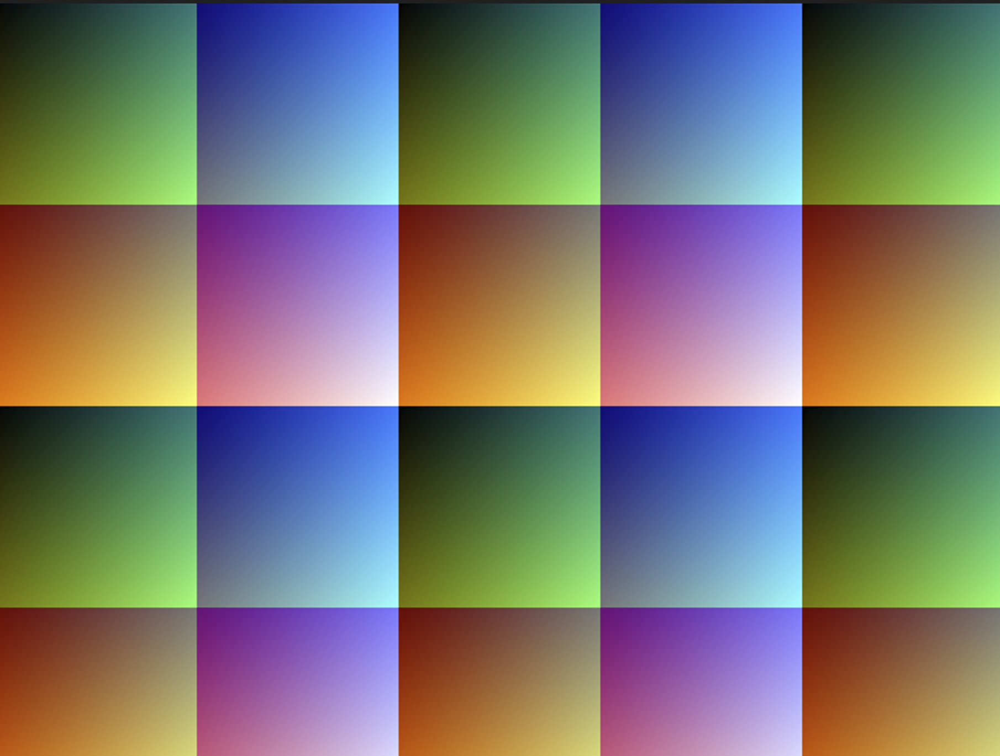

# TestBench Iteration #2

## Why didn't previous iterations work?
The core issue with previous versions was a misunderstanding of how pixels were streamed. I initally went off the assumption that the pixel packer outputed pixels one by one in order.  
i.e - pixel_1| pixel_2 | pixel_3 | pixel_4  
However this was not the case, and in order to pack the 4 24-bit pixels into 3 32-bit words the pixel packer uses the following state machine, which results in the sequence of 4 pixels being jumbled together.   
  
Fixing the visualiser was mainly a matter of untangling these pixels and adding/modifying checks for the user and valid signals. 

## How to use it
**(1) Run the following commands (identical to what ed uses with his example testbench)**  

```
iverilog -o stream streamer_tb.v packer.v test_streamer.v
vvp stream
gtkwave test.vcd                                                  
```    

The third command isn't really needed for a visualisation - it just opens the waveform viewer (helpful for understanding how pixels are packed and streamed).    
In addition to the .vcd file, a text file(word_stream.txt) will be generated with all the rgb values for each pixel.

**(2) Run the python code to generate an image from these pixel values.**  
You need to have the pillow and numpy python libraries installed for this. 
> Need to figure out why the images generated the by python and the image displayed via HDMI are different. (This is also the case in the jupiter notebook)

**Wierd things happen when I disregard the user flag and switch b with g in the example verilog - I get the output displayed on the fpga!!! Does it use rbg instead of rgb?. Also the implementation given here results in a lone irratic out of place pixel and the bottom left corner of the image**

Expected output  
  
Our output  


